- 📖 Learning Spec-Driven Development knowledge constantly
- 🎨 Exploring creative canvas/css coding with p5.js and vanilla js
- 🏠 New to WebGL
- 🤖️ Embracing AI field technology

---
#### Favorite AI Assistant

#### Good With

#### Used

<!--
**LKL2017/LKL2017** is a ✨ _special_ ✨ repository because its `README.md` (this file) appears on your GitHub profile.

Here are some ideas to get you started:

- 🔭 I’m currently working on ...
- 🌱 I’m currently learning ...
- 👯 I’m looking to collaborate on ...
- 🤔 I’m looking for help with ...
- 💬 Ask me about ...
- 📫 How to reach me: ...
- 😄 Pronouns: ...
- ⚡ Fun fact: ...
-->
